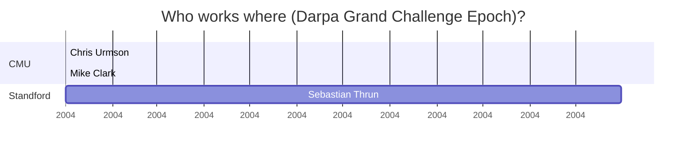
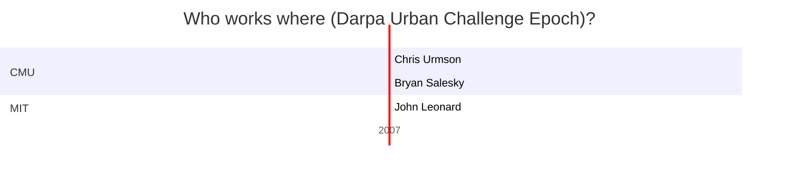
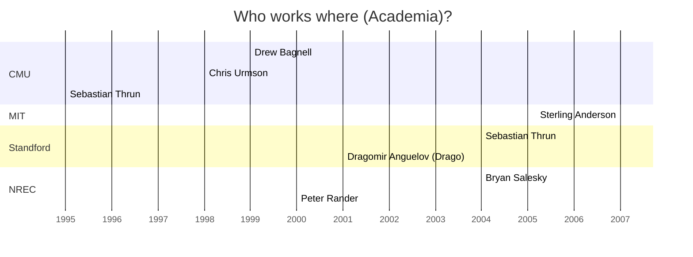
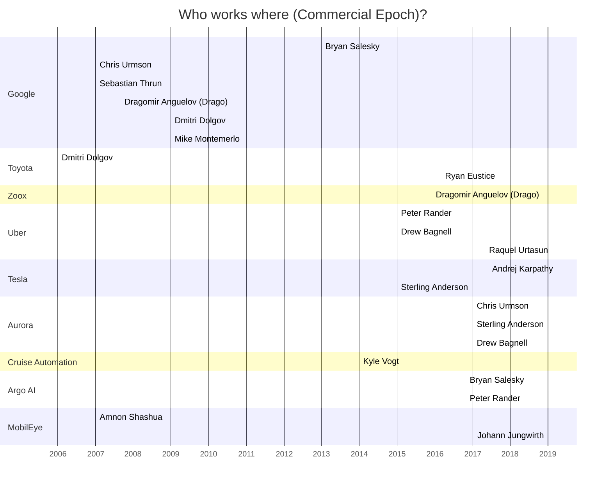

# Autonomy Nerdout Session - 2021.05.25

---
tags: nerdout, autonomy, business
---

`nerdout` `autonomy` `business`

[TOC]

## Topics

- [ ] Markts, Business value of autonomy and Valuation of Autonomy Startup
    - [ ] Why has Waymos valuation dropped so significantly.
    - [ ] Which commercial applications are likely to be impacted by Autonomy first
        - [ ] why
        - [ ] where

- [ ] Frontiers
    - [ ] Why are we not there yet
    - [ ] How are we going to get there
        - [ ] with Lidar or without?
            - [ ] If Lidar, do we need FCMW-Lidar?
            - [ ] How many Lidars
        - [ ] HD-Maps or without?
        - [ ] End-to-End AI or modular with classic algorithms
    - [ ] How long would it take for each frontier to get beyond it (Roughly, based on which assumptions)

- [ ] Regulation
- [ ] Fokus auf die deutschen Hersteller - Wer hat eine Chance und warum?
    - [ ] VW
    - [ ] BMW
    - [ ] Daimler

- [ ] Dudes

## Dudes

### Darpa 2004 - Red Team

* [Grand Challenge 2004 CMU Team](https://www.cmu.edu/cmtoday/issues/april-2004-issue/feature-stories/the-red-team/index.html)
    * Professor William “Red” Whittaker
    * [Red Team technology leader Chris Urmson](https://www.ri.cmu.edu/ri-people/christopher-urmson/)
    * Pre-mapping and routing strategies are directed by route leader Mike Clark

* [Urban Challenge Stanford Team](https://cs.stanford.edu/group/roadrunner/team.html)

