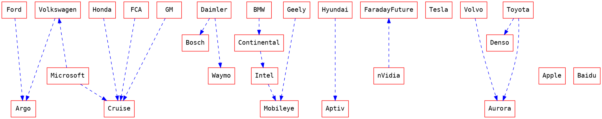

[TOC]

# TOPS
 * Cal DMV Disengagement Statisticc..
     * [ ] A good KPI?
     * [ ] Drawbacks?
 * scalability considerations
     * [ ] which approach can scale and how quickly
 * [ ] Service areas of Waymo / Cruise
 * [ ] Fleet Sizes of Waymo / Cruise (per service area)

 * [ ] find "common ground" (city / country) where mobileye, google and cruise are testing jointly and look at statistics again.
 * Deep dive into sensor suite
     * [ ] Lidar(s)
     * [ ] FMCW-Lidar
 * [ ] Mapping approaches
     * full
     * sparse
     * none (tesla)
 * [ ] Formal safety model: Mobileyes Responsiblity-Sensitive Safety (RSS)
     * https://www.mobileye.com/responsibility-sensitive-safety/
 * [x] Who is invested in / partners with whom?

# Google Waymo

* https://www.youtube.com/watch?v=g5SeVxYAZzk
    * Sehr defensives fahren

## Youtube
* JJ Ricks

## Fragen
* [ ] Warum haben Phoenix und Arizona zuerst die Driverless autos bekommen?
    * http://www3.weforum.org/docs/WEF_C4IR_Israel_Autonomous_Vehicle_Policy_Framework_2020.pdf

## Media
* [26.01.2021 Autopilot: Waymo-Chef glaubt nicht an autonom fahrende Teslas](https://www.golem.de/news/autopilot-waymo-chef-glaubt-nicht-an-autonom-fahrende-teslas-2101-153689.html)

* [Manager Magazin](https://www.manager-magazin.de/unternehmen/tech/autonomes-fahren-ranking-der-fuehrenden-firmen-von-waymo-bis-tesla-a-2389923d-2611-4e5a-88f1-04f0e7515654)

* https://sterlinganderson.info

# Cruise Automation

* https://www.youtube.com/watch?v=sliYTyRpRB8
* https://www.youtube.com/watch?v=s-8cYj_eh8E&t=2679s

* 2020 Disengagement results on half year intervals
* https://twitter.com/kvogt/status/1359230881454383105?ref_src=twsrc%5Etfw%7Ctwcamp%5Etweetembed%7Ctwterm%5E1359230881454383105%7Ctwgr%5E%7Ctwcon%5Es1_&ref_url=https%3A%2F%2Fthelastdriverlicenseholder.com%2F2021%2F02%2F09%2F2020-disengagement-reports-from-california%2F

* https://venturebeat.com/2020/02/26/california-dmv-releases-latest-batch-of-autonomous-vehicle-disengagement-reports/
* https://venturebeat.com/wp-content/uploads/2020/02/Cruise_Miles-Per-DMV-Reportable-Event.jpg?w=960&strip=all

## Strategy
* Test in San Francisco, until System refined

## Risks
* Learning area by hart?
* How well does it transfer to other
    * service areas?
    * countries?
    * rule sets

# Tesla

## Youtube

### Whole Mars Cataloge

* https://www.youtube.com/watch?v=dQG2IynmRf8&feature=youtu.be
* https://www.youtube.com/watch?v=XPrsRM2cxGs&t=0s

### Kim Paquette

* FSD Beta 48.35.1 (build 10) 36 minute unedited drive in Newport, RI: [youtube](https://www.youtube.com/watch?v=KCCYLLAKb0A)
* FSD Beta build 10.1 - failed two very difficult scenarios [youtube](https://www.youtube.com/watch?v=94GHhJYHH_E)

### Sean Moua

#### 2020.12.11 - Video Tesla Full Self Driving City Driving May 2020 Update 

VIdeo url: https://www.youtube.com/watch?v=bGEkr9i5Rtw

* Umgebungsmodell scheint nur nebenstehende Spuren zu erkennen

* [1:20](https://www.youtube.com/watch?v=bGEkr9i5Rtw&t=1m20s): Fußgänger wird eventuell nicht erkannt

* [1:33](https://www.youtube.com/watch?v=bGEkr9i5Rtw&t=1m33s): Driver has to intervene

* [2:28](https://www.youtube.com/watch?v=bGEkr9i5Rtw&t=2m28s): Lane detection looks very buggy

* [8:30](https://www.youtube.com/watch?v=bGEkr9i5Rtw&t=8m30s) Left turns don’t really work at all

* https://www.youtube.com/watch?v=M9zEsEb31X0
* https://www.youtube.com/watch?v=KCCYLLAKb0A
* https://www.youtube.com/watch?v=rOitcOMYvOQ

# Mobileye

* Keynote from Prof. Amnon Shoshua at CES 2021
    * https://www.youtube.com/watch?v=B7YNj66GxRA

15.01.2021

* https://www.youtube.com/watch?v=A1qNdHPyHu4
    * 3:40
* [3:40](https://www.youtube.com/watch?v=A1qNdHPyHu4&t=3m40s):
    * Fußgänger Informationen sind sehr gut
    * Es gibt Karteninformation (im Gegensatz zu Tesla)
    * Ampelinformationen sind sehr gut
    * Fußgängerüberwege sind sehr gut
* 
* [3:50](https://www.youtube.com/watch?v=A1qNdHPyHu4&t=3m50s): Ampel wird grün
    * Autos von der rechten Einfahrt verlassen Kreuzung sehr spät
    * Opel Corsa wird als rot markiert
    * Sprinter verdeckt Fahrzeuge auf derer Seite des Kreuzung, sie verschwinden dann aus der Karte
    * Sprinter wurde zum LKW
* [5:07](https://www.youtube.com/watch?v=A1qNdHPyHu4&t=5m07s)
    * Kartenfehler ? Linke Fahrbahnhälfte hat Fußgängerüberweg, rechte hat Ampel
    * Semantisch nicht korrekt
    * Kleiner Schwenker um den Fußgänger. Bahnplanung hat Fußgänger also erkannt.

* [5:43](https://www.youtube.com/watch?v=A1qNdHPyHu4&t=5m43s):

* [6:30](https://www.youtube.com/watch?v=A1qNdHPyHu4&t=6m30s):
    * Auto biegt in Kreuzung ein, obwohl noch ganz klar ein Auto von der rechten Seite vorgelassen wird und von der linken Seite noch weitere Autos angefahren kommen
    * Besser wäre, wenn das Auto noch gewartet hätte, bevor es in die Kreuzung einfährt
    * ODER:
        * Schnelleres Manöver, sodass man vor der G-Klasse einfädelt
* [8:10](https://www.youtube.com/watch?v=A1qNdHPyHu4&t=8m10s):
    * Fahrzeug muss durchgezogene Linie überqueren, um am Bus vorbeizufahren
* [11:15](https://www.youtube.com/watch?v=A1qNdHPyHu4&t=11m15s)
    * sehr wilde Karte
    * Fährt schon etwas über die Linie drüber

* [12:20](https://www.youtube.com/watch?v=A1qNdHPyHu4&t=12m20s)
    * LKW Wird rechts überholt

* [14:35](https://www.youtube.com/watch?v=A1qNdHPyHu4&t=14m35s)

* [15:39](https://www.youtube.com/watch?v=A1qNdHPyHu4&t=15m39s)
    * Aggressive manoeuvre is necessary to fulfull mission of making the exit

* [16:54](https://www.youtube.com/watch?v=A1qNdHPyHu4&t=16m54s)

* [20:02](https://www.youtube.com/watch?v=A1qNdHPyHu4&t=20m02s)
    * Yield in Roundabout

* [20:08](https://www.youtube.com/watch?v=A1qNdHPyHu4&t=20m08s)

* [27:48](https://www.youtube.com/watch?v=A1qNdHPyHu4&t=27m48s)

* [30:34](https://www.youtube.com/watch?v=A1qNdHPyHu4&t=30m34s)

* [39:25](https://www.youtube.com/watch?v=A1qNdHPyHu4&t=39m25s)

* [40:45](https://www.youtube.com/watch?v=A1qNdHPyHu4&t=40m45s)

* [41:46](https://www.youtube.com/watch?v=A1qNdHPyHu4&t=41m46s)

* [46:41](https://www.youtube.com/watch?v=A1qNdHPyHu4&t=46m41s)

* [53:16](https://www.youtube.com/watch?v=A1qNdHPyHu4&t=53m16s)

* [53:45](https://www.youtube.com/watch?v=A1qNdHPyHu4&t=53m45s)

* Saftey driver is uncomfortable

# Baidu

## Youtuber

### Baidu (official)

* [25.08.2020 The Future of Smart Transport is Here! | Hailing a Baidu Apollo Robotaxi in Changsha, Hunan](https://www.youtube.com/watch?v=AkI68JuhvUw)

# AutoX (Alibaba)

* [ ] Wirkt gestellt (Demofahrt?)

## Youtuber

### AutoX (official)

* [28.01.2021 - AutoX Opens Its Fully Driverless RoboTaxi Service to the Public in China (English)](https://www.youtube.com/watch?v=O69YEWpSacU)
* 4 Lidar Sensors?

# Daimler 

* [ ] was ist aus den Robotaxis in San Jose geworden

# Bosch

* https://www.youtube.com/watch?v=0D0ZN2tPihQ

# Nvidia

* https://www.youtube.com/watch?v=1W9q5SjaJTc
* 

* [4:56](https://www.youtube.com/watch?v=1W9q5SjaJTc) Changing Hi

# Disengagement Statictics

* 2020 - California
    * https://asia.nikkei.com/Business/Business-Spotlight/China-guides-its-self-driving-startups-into-the-fast-lane
    * https://thelastdriverlicenseholder.com/2021/02/09/2020-disengagement-reports-from-california/

* 2019
    * https://thelastdriverlicenseholder.com/2020/02/26/disengagement-report-2019/

* 2018
    * https://thelastdriverlicenseholder.com/2019/02/13/update-disengagement-reports-2018-final-results/

# Apple

# Testing Criteria and Roadmap

* Cruise: Testing in San Francisco. 
    * [Cooperation with Walmart to start grocery delivery](https://corporate.walmart.com/newsroom/2020/11/10/walmart-teams-up-with-cruise-to-pilot-all-electric-self-driving-delivery-powered-by-100-renewable-energy)
* Waymo:
    * 2020-06-30 [Waymo expands into automated dilvery](https://venturebeat.com/2020/06/30/waymo-expanding-autonomous-truck-testing-in-american-southwest/)
        * expansion in south west of US 
        * [Freight volumes US - Rail vs Road](https://seekingalpha.com/article/3966919-rail-vs-road-transportation-economics-in-u-s)
    * 2021-02-17 [Waymo expands robo taxi testing in San Francisco](https://venturebeat.com/2021/02/17/waymo-begins-robo-taxi-tests-in-san-francisco/)
* Daimler
    * 2020-10-27 [Daimler and Waymo collaborate on automated driving (L4)](https://www.daimler.com/investoren/berichte-news/finanznachrichten/20201027-dt-und-waymo.html)

# Business opportunities

* the real business value starts at Level 4
    * before that, human attention and supervision is still required, hence all Level 1 ... 3 assistance features are only gimics.

## Cooperation Graph

[Graphviz Howto](https://www.tonyballantyne.com/graphs.html)

[Major Players](https://www.globenewswire.com/news-release/2021/05/13/2229091/28124/en/Global-Autonomous-Cars-Market-Report-2021-Major-Players-are-BMW-Tesla-Ford-GM-Nissan-Daimler-Toyota-Volkswagen-Volvo-and-Waymo-Forecast-to-2025-2030.html)
[Toyota-Denso-Aurora](https://www.autoblog.com/2021/02/09/toyota-denso-aurora-self-driving-autonomous-minivan/?guccounter=1&guce_referrer=aHR0cHM6Ly9kdWNrZHVja2dvLmNvbS8&guce_referrer_sig=AQAAAGBw6EaEoNFacPcXsKYcqrNWhaVVM2_ttSCjxqq36U9FdzI7b361zroQLJeQm2-mgfD27VLwneViKu8Jeq_pz9zi8elW6pWJR_xnQfLcZCDtQnRCnlt5nSeClZRc4NjeYFmMAOR5k3_6Hxo9zkXM2UdsYLnKMdzYv-Yz1EWakTq0)
[Game of Partnerships (wired.com)](https://www.wired.com/story/self-driving-tech-game-partnerships/)
[Market Overview (medium.com)](https://medium.com/swlh/autonomous-driving-market-overview-b8c71d81c072)

# Argo AI

* [CEO Bryan ](https://www.argo.ai/team/bryan-salesky/)
https://www.theverge.com/2021/1/19/22238407/microsoft-cruise-self-driving-investment-azure-cloud
* [Argo.ai Investors crunchbase](https://www.crunchbase.com/organization/argo-ai/company_financials)

# Volkswagen

* [Eigene Autonomy GmbH ausgegründet](https://www.volkswagenag.com/de/news/2020/01/Volkswagen_Autonomy.html)

# Sensors

## FMCW (Blackmore)

--> Bought by Aurora
* https://aurora.tech/blog/aurora-voices-with-randy-reibel

# Ride Hailing Services

* https://www.moia.io/de-DE